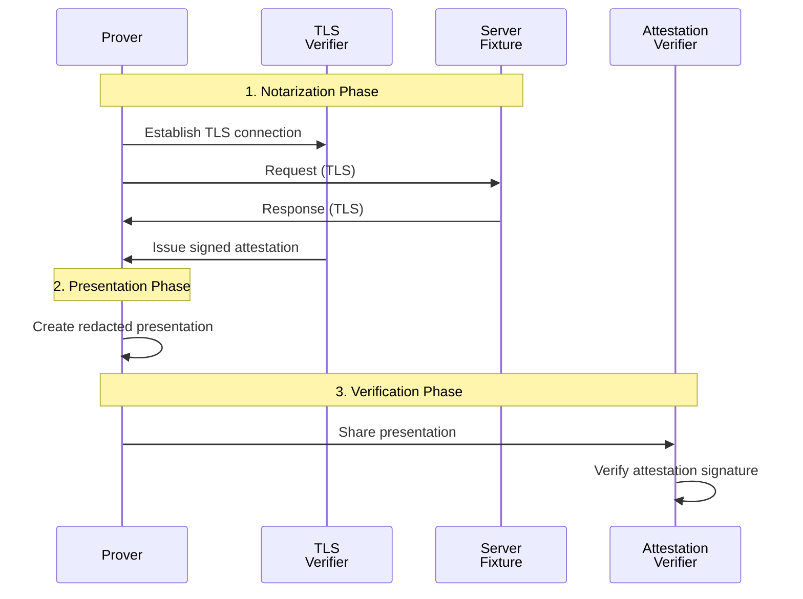

# Attestation Example

This example demonstrates an **attestation workflow**: notarizing data from a server with a trusted third party (Notary), then creating verifiable presentations with selective disclosure of sensitive information to a Verifier.

## 🔍 How It Works



### The Three-Step Process

1. **🔐 Notarize**: Prover collaborates with Notary to create an authenticated TLS session and obtain a signed attestation
2. **✂️ Present**: Prover creates a selective presentation, choosing which data to reveal or redact
3. **✅ Verify**: Anyone can verify the presentation's authenticity using the Notary's public key

## 🚀 Quick Start

### Step 1: Notarize Data

**Start the test server** (from repository root):
```bash
RUST_LOG=info PORT=4000 cargo run --bin tlsn-server-fixture
```

**Run the notarization** (in a new terminal):
```bash
RUST_LOG=info SERVER_PORT=4000 cargo run --release --example attestation_prove
```

**Expected output:**
```
Notarization completed successfully!
The attestation has been written to `example-json.attestation.tlsn` and the corresponding secrets to `example-json.secrets.tlsn`.
```

### Step 2: Create Verifiable Presentation

**Generate a redacted presentation:**
```bash
cargo run --release --example attestation_present
```

**Expected output:**
```
Presentation built successfully!
The presentation has been written to `example-json.presentation.tlsn`.
```

> 💡 **Tip**: You can create multiple presentations from the same attestation, each with different redactions!

### Step 3: Verify the Presentation

**Verify the presentation:**
```bash
cargo run --release --example attestation_verify
```

**Expected output:**
```
Verifying presentation with {key algorithm} key: { hex encoded key }

**Ask yourself, do you trust this key?**

-------------------------------------------------------------------
Successfully verified that the data below came from a session with test-server.io at { time }.
Note that the data which the Prover chose not to disclose are shown as X.

Data sent:

GET /formats/json HTTP/1.1
host: test-server.io
accept: */*
accept-encoding: identity
connection: close
user-agent: XXXXXXXXXXXXXXXXXXXXXXXXXXXXXXXXXXXXXXXXXXXXXXXXXXXXXXXXXXXXXXXXXXXXXXXXXXXXXXXXXXXXXXXXXXXXXXXXXXXXX

Data received:

HTTP/1.1 200 OK
content-type: application/json
content-length: 722
connection: close
date: Mon, 08 Sep 2025 09:18:29 GMT

XXXXXX1234567890XXXXXXXXXXXXXXXXXXXXXXXXJohn DoeXXXXXXXXXXXXXXXXXXXXXXXXXXXXXXXXXXXXXXXXXXXXXXXXXXXXXXXXXXXXXXXXXXXXXXXXXXXXXXXXXXXXXXXXXXXXXXXXXXXXXXXXXXXXXXXXXXXXXXXXXXXXXXXXXXXXXXXXXXXXXXXXXXXXXXXXXXXXXXXXXXXXXXXXXXXXXXXXXXXXXXXXXXXXXXXXXXXXXXXXXXXXXXXXXXXXXXXXXXXXXXXXXXXXXXXXXXXXXXXXXXXXXXXXXXXXXXXXXXXXXXXXXXXXXXXXXXXXXXXXXXXXXXXXXXXXXXXXXXXXXXXXXXXXXXXXXXXXXXXXXXXXXXXXXXXXXXXXXXXXXXXXXXXXXXXXXXXXXXXXXXXXXXXXXXXXXXXXXXXXXXXXXXXXXXXXXXXXXXXXXXXXXXXXXXXXXXXXXXXXXXXXXXXXXXXXXXXXXXXXXXXXXXXXXXXXXXXXXXXXXXXXXXXXXXXXXXXXXXXXXXXXXXXXXXXXXXXXXXXXXXXXXXXXXXXXXXXXXXXXXXXXXXXXXXXXXXXXXXXXXXXXXXXXXXXXXXXXXXXXXXXXXXXXXXXXXXXXXXXXXXXXXXXXXXXXXXXXXXXXXXXXXXXXXXXXXXXXXXXXXXXXXXXXXXXXXXXXXXXXXXXXXXXXXXXXXXXXXXXXXXXXXXXXX1.2XX
```

## 🎯 Use Cases & Examples

### JSON Data (Default)
Perfect for API responses, configuration data, or structured information:
```bash
# All three steps use JSON by default
SERVER_PORT=4000 cargo run --release --example attestation_prove
cargo run --release --example attestation_present
cargo run --release --example attestation_verify
```

### HTML Content
Ideal for web pages, forms, or any HTML-based data:
```bash
# Notarize HTML content
SERVER_PORT=4000 cargo run --release --example attestation_prove -- html
cargo run --release --example attestation_present -- html
cargo run --release --example attestation_verify -- html
```

### Authenticated/Private Data
For APIs requiring authentication tokens, cookies, or private access:
```bash
# Notarize private data with authentication
SERVER_PORT=4000 cargo run --release --example attestation_prove -- authenticated
cargo run --release --example attestation_present -- authenticated
cargo run --release --example attestation_verify -- authenticated
```

### Debug Mode

For detailed logging and troubleshooting:
```bash
RUST_LOG=debug,yamux=info,uid_mux=info SERVER_PORT=4000 cargo run --release --example attestation_prove
```

### Generated Files

After running the examples, you'll find:
- **`*.attestation.tlsn`**: The cryptographically signed attestation from the Notary
- **`*.secrets.tlsn`**: Cryptographic secrets needed to create presentations
- **`*.presentation.tlsn`**: The verifiable presentation with your chosen redactions

## 🔐 Security Considerations

### Trust Model
- ✅ **Notary Key**: The presentation includes the Notary's verifying key - The verifier must trust this key
- ✅ **Data Authenticity**: Cryptographically guaranteed that data came from the specified server
- ✅ **Tamper Evidence**: Any modification to the presentation will fail verification
- ⚠️ **Notary Trust**: The verifier must trust the Notary not to collude with the Prover

### Production Deployment
- 🏭 **Independent Notary**: Use a trusted third-party Notary service (not a local one)
- 🔒 **Key Management**: Implement proper Notary key distribution and verification
- 📋 **Audit Trail**: Maintain logs of notarization and verification events
- 🔄 **Key Rotation**: Plan for Notary key updates and migration

> ⚠️ **Demo Notice**: This example uses a local test server and local Notary for demonstration. In production, use trusted third-party Notary services and real server endpoints.
