# Basic Zero-Knowledge Age Verification with TLSNotary

This example demonstrates **privacy-preserving age verification** using TLSNotary and zero-knowledge proofs. It allows a prover to demonstrate they are 18+ years old without revealing their actual birth date or any other personal information.

## 🔍 How It Works (simplified overview)

```mermaid
sequenceDiagram
    participant S as Tax Server<br/>(fixture)
    participant P as Prover
    participant V as Verifier

    P->>S: Request tax data (with auth token) (TLS)
    S->>P: Tax data including `date_of_birth` (TLS)
    P->>V: Share transcript with redactions
    P->>V: Commit to blinded hash of birth date
    P->>P: Generate ZK proof of age ≥ 18
    P->>V: Send ZK proof
    V->>V: Verify transcript & ZK proof
    V->>V: ✅ Confirm: Prover is 18+ (no birth date revealed)
```



### The Process

1. **TLS Commitment**: The Prover fetches tax information containing their birth date, while the Verifier jointly verifies the TLS session to ensure the data comes from the authentic server.
2. **Selective Disclosure**:
   * The authorization token is **redacted**: the Verifier sees the plaintext request but not the token.
   * The birth date is **committed** as a blinded hash: the Verifier cannot see the date, but the Prover is cryptographically bound to it.  
   (Depending on the use case more data can be redacted or revealed)
3. **Zero-Knowledge Proof**: The Prover generates a ZK proof that the committed birth date corresponds to an age ≥ 18.
4. **Verification**: The Verifier checks both the TLS transcript and the ZK proof, confirming age ≥ 18 without learning the actual date of birth.


### Example Data

The tax server returns data like this:
```json
{
    "tax_year": 2024,
    "taxpayer": {
        "idnr": "12345678901",
        "first_name": "Max",
        "last_name": "Mustermann",
        "date_of_birth": "1985-03-12",
        // ...
    }
}
```

## 🔐 Zero-Knowledge Proof Details

The ZK circuit proves: **"I know a birth date that hashes to the committed value AND indicates I am 18+ years old"**

**Public Inputs:**
- ✅ Verification date
- ✅ Committed blinded hash of birth date

**Private Inputs (Hidden):**
- 🔒 Actual birth date plaintext
- 🔒 Random blinder used in hash commitment

**What the Verifier Learns:**
- ✅ The prover is 18+ years old
- ✅ The birth date is authentic (from the TLS session)

Everything else remains private.

## 🏃 Run the Example

1. **Start the test server** (from repository root):
   ```bash
   RUST_LOG=info PORT=4000 cargo run --bin tlsn-server-fixture
   ```

2. **Run the age verification** (in a new terminal):
   ```bash
   SERVER_PORT=4000 cargo run --release --example basic_zk
   ```

3. **For detailed logs**:
   ```bash
   RUST_LOG=debug,yamux=info,uid_mux=info SERVER_PORT=4000 cargo run --release --example basic_zk
   ```

### Expected Output

```
Successfully verified https://test-server.io:4000/elster
Age verified in ZK: 18+ ✅

Verified sent data:
GET https://test-server.io:4000/elster HTTP/1.1
host: test-server.io
connection: close
authorization: 🙈🙈🙈🙈🙈🙈🙈🙈🙈🙈🙈🙈🙈🙈🙈🙈🙈🙈🙈🙈🙈🙈🙈🙈🙈🙈

Verified received data:
🙈🙈🙈🙈🙈🙈🙈🙈[truncated for brevity]...🙈🙈🙈🙈🙈"tax_year":2024🙈🙈🙈🙈🙈...
```

> 💡 **Note**: In this demo, both Prover and Verifier run on the same machine. In production, they would operate on separate systems.
> 💡 **Note**: This demo assumes that the tax server serves correct data, and that only the submitter of the tax data has access to the specified page.

## 🛠 Development

### Project Structure

```
basic_zk/
├── prover.rs                   # Prover implementation
├── verifier.rs                 # Verifier implementation
├── types.rs                    # Shared types
└── basic_zk.rs                 # Main example runner
├── noir/                       # Zero-knowledge circuit
│   ├── src/main.n              # Noir circuit code
│   ├── target/                 # Compiled circuit artifacts
│   └── Nargo.toml              # Noir project config
│   └── Prover.toml             # Example input for `nargo execute`
│   └── generate_test_data.rs   # Rust script to generate Noir test data
└── README.md
```

### Noir Circuit Commands

We use [Mopro's `noir_rs`](https://zkmopro.org/docs/crates/noir-rs/) for ZK proof generation.  The **circuit is pre-compiled and ready to use**. You don't need to install Noir tools to run the example. But if you want to change or test the circuit in isolation, you can use the following instructions.

Before you proceed, we recommend to double check that your Noir tooling matches the versions used in Mopro's `noir_rs`:
```sh
# Install correct Noir and BB versions (important for compatibility!)
noirup --version 1.0.0-beta.8
bbup -v 1.0.0-nightly.20250723
```

If you don't have `noirup` and `bbup` installed yet, check [Noir's Quick Start](https://noir-lang.org/docs/getting_started/quick_start).

To compile the circuit, go to the `noir` folder and run `nargo compile`.

To check and experiment with the Noir circuit, you can use these commands:

* Execute Circuit: Compile the circuit and run it with sample data from `Prover.toml`:
    ```sh
    nargo execute
    ```
* Generate Verification Key: Create the verification key needed to verify proofs
    ```sh
    bb write_vk -b ./target/noir.json -o ./target
    ```
* Generate Proof: Create a zero-knowledge proof using the circuit and witness data.
    ```sh
    bb prove --bytecode_path ./target/noir.json --witness_path ./target/noir.gz -o ./target
    ```
* Verify Proof: Verify that a proof is valid using the verification key.
    ```sh
    bb verify -k ./target/vk -p ./target/proof
    ```
* Run the Noir tests:
    ```sh
    nargo test --show-output
    ```
  To create extra tests, you can use `./generate_test_data.rs` to help with generating correct blinders and hashes.

## 📚 Learn More

- [TLSNotary Documentation](https://docs.tlsnotary.org/)
- [Noir Language Guide](https://noir-lang.org/)
- [Zero-Knowledge Proofs Explained](https://ethereum.org/en/zero-knowledge-proofs/)
- [Mopro ZK Toolkit](https://zkmopro.org/)
