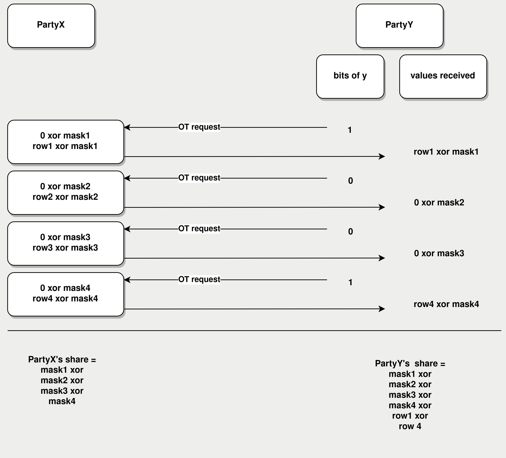

# Computing MAC in 2PC

1. [What is a MAC](#section1)
2. [How a MAC is computed in AES-GCM](#section2)
3. [Computing MAC using secure two-party computation (2PC)](#section3) 


## 1. What is a MAC <a name="section1"></a>

When sending encrypted ciphertext to the Webserver, the User attaches a checksum to it. The Webserver uses this checksum to check whether the ciphertext has been tampered with while in transit. This checksum is known as the "authentication tag" and also as the "Message Authentication Code" (MAC).

The first few paragraphs of [this article](https://zsecurity.org/bit-flipping-attacks-against-cipher-block-chaining-algorithms/) explain what would happen if there was no MAC: it would be possible for a malicious actor to modify the **plaintext** by flipping certain bits of the **ciphertext**.


## 2. How a MAC is computed in AES-GCM <a name="section2"></a>

In TLS the plaintext is split up into chunks called "TLS records". Each TLS record is encrypted and a MAC is computed for the ciphertext. The MAC (in AES-GCM) is obtained by XORing together the `GHASH output` and the `GCTR output`. Let's see how each of those outputs is computed:

#### 2.1 GHASH output

The `GHASH output` is the output of the GHASH function described in the [NIST publication](https://nvlpubs.nist.gov/nistpubs/legacy/sp/nistspecialpublication800-38d.pdf) in section 6.4 in this way: "In effect, the GHASH function calculates \\(  \small{ X1•H^{m} ⊕ X2•H^{m−1} ⊕ ... ⊕ Xm−1•H^{2} ⊕ Xm•H } \\)" 

In other words, GHASH splits up the ciphertext into 16-byte blocks, each block is numbered \\( \small{ X_1, X_2, ... }\\) etc. There's also \\( \small{H} \\) which is called the `GHASH key`. We need to raise \\( \small{H} \\) to as many powers as there are blocks, i.e. if we have 5 blocks then we need 5 powers: \\( \small{ H, H^2, H^3, H^4, H^5 } \\). Each block is multiplied by the corresponding power and all products are summed together.

"•" is a special type of multiplication called `multiplication in a finite field` described in section 6.3 of the NIST publication. Below is the pseudocode for multiplying two 128-bit field elements `x` and `y` in a finite field:

Figure 1: multiplication in a finite field<a name="Figure_1"></a>
```
1. result = 0
2. R = 0xE1000000000000000000000000000000
3. bit_length = 128
4. for i=0 upto bit_length-1
5.    if y[i] == 1
6.       result ^= x
7. x = (x >> 1) ^ ((x & 1) * R)
8. return result
```

⊕ is `addition in a finite field` and it is defined as XOR.

Standard math properties hold in finite field math, viz. commutative: \\( \small{ a+b=b+a } \\) and distributive: \\( \small{ a(b+c)=ab+ac } \\).

#### 2.1 GCTR output 

The `GCTR output` is computed by simply AES-ECB encrypting a counter block with the counter set to 1 (the iv, nonce and AES key are the same as for the rest of the TLS record).  


## 3. Computing MAC using secure two-party computation (2PC) <a name="section3"></a>

Below we introduce the protocol. At the start of the protocol each party has:
1. ciphertext blocks \\( \small{ X_1, X_2, ... } \\).

(the following items were obtained at an earlier stage of the TLSNotary protocol):

2. his XOR share of \\( \small{ H } \\): the `User` has \\( \small{ H_u } \\) and the `Notary` has \\( \small{ H_n } \\).
3. his XOR share of the `GCTR output`: the `User` has \\( \small{ GCTR_u } \\) and the `Notary` has \\( \small{ GCTR_n } \\).

The goal of the protocol is to compute the MAC in such a way that neither party would learn the other party's share of \\( \small{ H } \\) i.e. the `GHASH key` share.

#### 3.1 Example with one ciphertext block
Suppose that the ciphertext consists of only 1 block \\( \small{ X1 } \\). The `GHASH_output` will be:

\\( \small{ X_1•H = X_1•(H_u ⊕ H_n) = X_1•H_u ⊕ X_1•H_n } \\)

The `User` and the `Notary` will compute locally the left and the right terms respectively. Then each party will XOR their result to the `GCTR output` share and will get their XOR share of the MAC:

`User`  : \\( \small{X_1 • H_u \\quad XOR \\quad CGTR_u = MAC_u} \\)

`Notary`: \\( \small{X_1 • H_n \\quad XOR \\quad CGTR_n = MAC_n} \\)

Finally, the `Notary` sends \\( \small{MAC_n}\\) to the `User` who obtains: 

\\( \small{ MAC = MAC_n \\quad XOR \\quad MAC_u} \\)

#### 3.2 Example with two ciphertext blocks. Free Squaring.

Now, let's suppose that the ciphertext consists of 2 blocks \\( \small{ X_1 }\\) and \\( \small{ X_2 }\\). The `GHASH_output` will be:

\\( \small{ X_1 • (H_u ⊕ H_n) + X_2 • H^2 } \\)

The only unknown here is:

\\( \small{ H^2 = (H_u ⊕ H_n)^2 = (H_u)^2 ⊕ 2(H_u • H_n) ⊕ (H_n)^2 = (H_u)^2 ⊕ (H_n)^2 } \\)

The reason why the middle term \\( \small{ 2(H_u•H_n) }\\) disappeared is this: \\( \small{2} \\) is not a field element, so `multiplication in a finite field` cannot be applied to it. Instead, we substitute \\( \small { 2(H_u•H_n) }\\) with \\( \small { (H_u • H_n) ⊕ (H_u • H_n) } \\). Since ⊕ is defined as XOR, we are essentially XORing the value to itself and get 0. 

To sum up, each party can locally square their share of \\( \small{H}\\) and get a share of \\( \small{H^2}\\). We call this method `Free Squaring` ("free" meaning "without any communication cost"). If e.g. the parties had their shares of \\( \small{H^3}\\) they could repeatedly perform `Free Squaring` to obtain their shares of \\( \small{ H^6, H^{12}, H^{24}, H^{48}} \\) etc.

#### 3.3 Example with three ciphertext blocks. 2PC multiplication.

Now, let's suppose that the ciphertext consists of 3 blocks \\( \small {X_1, X_2, X_3} \\) and the parties already performed `Free Squaring` and have their shares of \\( \small{H^2} \\). The `GHASH_output` will be:

\\( \small{ X_1•(H_u + H_n) + X_2•(H^2_u + H^2_n)+ X_3•H^3 } \\)

Observe that:

\\( \small { H^3 = H^2 * H = (H^2_u + H^2_n) * (H_u + H_n) = H^2_u * H_u + H^2_u * H_n + H^2n * H_u + H^2_n * H_n } \\)

The 1st and the 4th terms can be computed locally by the `User` and the `Notary` respectively. Only the 2nd and the 3rd terms need to be computed using `2PC`.

In [Figure 1](#Figure_1) it can be seen that for each of the 128 loop iterations, the value of `x` changes independently of `y`. This allows `PartyX` (the party who has the `x` value) to compute a table (we call it an `Xtable`) of 128 rows where each row's value equals the value of `x` in one of the 128 iterations. Then, depending on the bit of `y`, the corresponding `Xtable` row will either be XORed to the result or be ignored.

The protocol below which we dub `Mul_2PC` shows how to perform `multiplication in a finite field` using [1-out-of-2 Oblivious Transfer](https://en.wikipedia.org/wiki/Oblivious_transfer#1–2_oblivious_transfer) (OT). `PartyX` computes an `Xtable` with 4 rows and masks each row's value as well as the 0's value. `PartyY` is the OT receiver and receives a masked `Xtable` row (if the bit of `y` is 1) or a masked 0 (if the bit of `y` is 1). We illustrate `Mul_2PC` for 4-bit values:



Note how neither party has the actual result of the multiplication i.e. (row1 XOR row4). The parties only have their XOR shares of the result.


Using `Free Squaring` and `Mul_2PC`, the parties can start with their shares of \\( \small{ H } \\) and compute `GHASH output` for any ciphertext size.

#### 3.4 Example with nine ciphertext blocks. Block Aggregation.

We present an optimization we call `Block Aggregation` which allows to decrease both the amount of rounds of communication between the parties and the amount of OT instances.


Suppose that the ciphertext consists of 9 blocks \\( \small{ X_1, ..., X_9 } \\) and that the parties already ran `Mul_2PC` to obtain their shares of \\( \small{ H^3 } \\). After performing `Free Squaring` on their shares of \\( \small{ H^2 } \\) and \\( \small{ H^3 } \\), here are all the shares of powers which each party has:
\\( \small{ H, H^2, H^3, H^4, H^6, H^8 } \\)

Naively, the parties could use `Mul_2PC` to compute their shares of \\( \small{ H^5, H^7, H^9 } \\) using 3 invocations of `Mul_2PC`. We now show how this can be done with 2 invocations of `Mul_2PC`. 

Recalling that:

\\( \small{ H^5•X_5 = (H^4_n + H^4_u)(H_n + H_u)X_5 = H^4_nH_nX_5 + \color{blue}{H^4_nH_uX_5} + \color{blue}{H^4_uH_nX_5} + H^4_uH_uX_5 } \\)
\\( \small{ H^7•X_7 = (H^6_n + H^6_u)(H_n + H_u)X_7 = H^6_nH_nX_7 + \color{blue}{H^6_nH_uX_7} + \color{blue}{H^6_uH_nX_7} + H^6_uH_uX_7 } \\)
\\( \small{ H^9•X_9 = (H^8_n + H^8_u)(H_n + H_u)X_9 = H^8_nH_nX_9 + \color{blue}{H^8_nH_uX_9} + \color{blue}{H^8_uH_nX_9} + H^8_uH_uX_9 } \\)

Above, we <span style="color:blue">highlighted</span>  all terms which the parties cannot compute locally and must compute using `Mul_2PC`. The sum of the highlighted terms can be represented as:

\\( \small{ H^4_n\color{blue}{H_u}X_5 + H^4_u\color{red}{H_n}X_5 + H^6_n\color{blue}{H_u}X_7 + H^6_u\color{red}{H_n}X_7 + H^8_n\color{blue}{H_u}X_9 + H^8_u\color{red}{H_n}X_9 = \\\ \color{blue}{H_u}(H^4_nX_5 + H^6_nX_7 + H^8_nH_9) + \color{red}{H_n}(H^4_uX_5 + H^6_uX_7 + H^8_uH_9) } \\)

The terms in brackets can be locally computed by the respective party. Let's call the term on the left `termN` and the term on the right `termU`. Then we can re-write the above to show that only 2 `Mul_2PC` are needed:

\\( \small{ \color{blue}{H_u} • termN + \color{red}{H_n} • termU } \\)

Each party will combine his shares from `Mul_2PC` with all the terms he computed locally earlier and will obtain his share of the `GHASH_block`.


#### 3.5 Security considerations

`PartyX` may act maliciously and craft the `Xtable` in a way which leaks bits of y through `PartyY`s output of `Mul_2PC`. For this reason, the role of `GCTR_output` share is crucial in ensuring malicious security of the protocol. The `GCTR_output` share serves essentially as a one-time pad masking `PartyY`'s potentially leaky `GHASH_output` from `PartyX`.  


