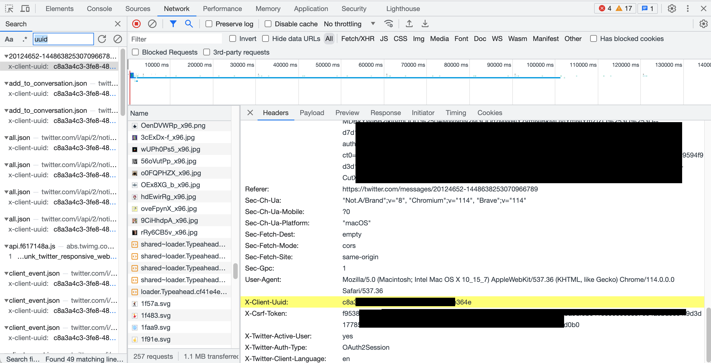

# Notarize Twitter DMs

The `twtter_dm.rs` example sets up a TLS connection with Twitter and notarizes the requested DMs. The full received transcript is notarized in one commitment, so nothing is redacted. The resulting proof is written to a local JSON file (`twitter_dm_proof.json`) for easier inspection.

This involves 3 steps:
1. Configure the inputs
2. Start the (local) notary server
3. Notarize

## Inputs

In this tlsn/examples/twitter folder, create a `.env` file.
Then in that `.env` file, set the values of the following constants by following the format shown in this [example env file](./.env.example).

| Name            | Example                                                 | Location in Request Headers Section (within Network Tab of Developer Tools)      |
| --------------- | ------------------------------------------------------- | -------------------------------------------------------------------------------- |
| CONVERSATION_ID | `20124652-973145016511139841`                           | Look for `Referer`, then extract the `ID` in `https://twitter.com/messages/<ID>` |
| AUTH_TOKEN      | `670ccccccbe2bbbbbbbc1025aaaaaafa55555551`              | Look for `Cookie`, then extract the `token` in `;auth_token=<token>;`            |
| ACCESS_TOKEN    | `AAAAAAAAAAAAAAAAAAAAANRILgAA...4puTs%3D1Zv7...WjCpTnA` | Look for `Authorization`, then extract the `token` in `Bearer <token>`           |
| CSRF_TOKEN      | `77d8ef46bd57f722ea7e9f...f4235a713040bfcaac1cd6909`    | Look for `X-Csrf-Token`, then copy the entire value                              |

You can obtain these parameters by opening [Twitter](https://twitter.com/messages/) in your browser and accessing the message history you want to notarize. Please note that notarizing only works for short transcripts at the moment, so choose a contact with a short history.

Next, open the **Developer Tools**, go to the **Network** tab, and refresh the page. Then, click on **Search** and type `uuid` as shown in the screenshot below — all of these constants should be under the **Request Headers** section. Refer to the table above on where to find each of the constant value.



## Start the notary server
1. Edit the notary server [config file](../../../notary/server/config/config.yaml) to turn off TLS so that self-signed certificates can be avoided.
   ```yaml
    tls:
        enabled: false
        ...
   ```
2. Run the following at the root level of this repository to start the notary server:
   ```shell
   cd notary/server
   cargo run --release
   ```

The notary server will now be running in the background waiting for connections.

For more information on how to configure the notary server, please refer to [this](../../../notary/server/README.md#running-the-server).

## Notarize

In this tlsn/examples/twitter folder, run the following command:

```sh
RUST_LOG=DEBUG,uid_mux=INFO,yamux=INFO cargo run --release --example twitter_dm
```

If everything goes well, you should see output similar to the following:

```log
2024-06-26T08:45:15.435493Z DEBUG notary_client::client: Setting up tcp connection...
2024-06-26T08:45:15.436451Z DEBUG notary_client::client: Sending configuration request: Request { method: POST, uri: http://127.0.0.1:7047/session, version: HTTP/1.1, headers: {"host": "127.0.0.1", "content-type": "application/json"}, body: Left(Full { data: Some(b"{\"clientType\":\"Tcp\",\"maxSentData\":4096,\"maxRecvData\":16384}") }) }
2024-06-26T08:45:15.442448Z DEBUG notary_client::client: Sent configuration request
2024-06-26T08:45:15.442525Z DEBUG notary_client::client: Configuration response: NotarizationSessionResponse { session_id: "60fdaee7-fb36-420f-96e7-bfeb8732623c" }
2024-06-26T08:45:15.442532Z DEBUG notary_client::client: Sending notarization request: Request { method: GET, uri: http://127.0.0.1:7047/notarize?sessionId=60fdaee7-fb36-420f-96e7-bfeb8732623c, version: HTTP/1.1, headers: {"host": "127.0.0.1", "connection": "Upgrade", "upgrade": "TCP"}, body: Right(Empty) }
2024-06-26T08:45:15.442883Z DEBUG notary_client::client: Sent notarization request
2024-06-26T08:45:18.569677Z DEBUG setup:setup_mpc_backend: tlsn_prover::tls: MPC backend setup complete
2024-06-26T08:45:18.596747Z DEBUG twitter_dm: Sending request
2024-06-26T08:45:18.607345Z DEBUG connect:tls_connection: tls_client::client::hs: ALPN protocol is None    
2024-06-26T08:45:18.607360Z DEBUG connect:tls_connection: tls_client::client::hs: Using ciphersuite Tls12(Tls12CipherSuite { suite: TLS_ECDHE_RSA_WITH_AES_128_GCM_SHA256, algorithm: AES_128_GCM })    
2024-06-26T08:45:18.607528Z DEBUG connect:tls_connection: tls_client::client::tls12: ECDHE curve is ECParameters { curve_type: NamedCurve, named_group: secp256r1 }    
2024-06-26T08:45:18.607539Z DEBUG connect:tls_connection: tls_client::client::tls12: Server DNS name is DnsName(DnsName(DnsName("twitter.com")))    
2024-06-26T08:45:18.607838Z DEBUG connect:handle:client_key: key_exchange::exchange: received public key share from follower
2024-06-26T08:45:19.740173Z DEBUG connect:tls_connection: tls_client_async: handshake complete
2024-06-26T08:45:20.442786Z DEBUG connect:tls_connection: tls_client_async: server closed connection
2024-06-26T08:45:20.442852Z DEBUG connect:commit: tls_mpc::leader: committing to transcript
2024-06-26T08:45:23.770382Z DEBUG twitter_dm: Sent request
2024-06-26T08:45:23.770400Z DEBUG twitter_dm: Request OK
2024-06-26T08:45:23.770382Z DEBUG connect:tls_connection: tls_client_async: client shutdown
2024-06-26T08:45:23.770469Z DEBUG twitter_dm: {
  "conversation_timeline": {
    "entries": [
      {
        "message": {
          ...
        }
      },
      ...
    ],
    ...
}
2024-06-26T08:45:23.770497Z DEBUG connect:close_connection: tls_mpc::leader: closing connection
2024-06-26T08:45:23.770687Z DEBUG connect: tls_mpc::leader: leader actor stopped
2024-06-26T08:45:23.780574Z DEBUG finalize: tlsn_prover::tls::notarize: starting finalization
2024-06-26T08:45:23.788046Z DEBUG finalize: tlsn_prover::tls::notarize: received OT secret
2024-06-26T08:45:26.334296Z  INFO finalize:poll{role=Client}:client_handle_inbound: uid_mux::yamux: remote closed connection
2024-06-26T08:45:26.334316Z  INFO finalize:poll{role=Client}: uid_mux::yamux: connection complete
2024-06-26T08:45:26.334612Z DEBUG twitter_dm: Notarization complete!
```

If the transcript was too long, you may encounter the following error:

```
thread 'tokio-runtime-worker' panicked at 'called `Result::unwrap()` on an `Err` value: IOError(Custom { kind: InvalidData, error: BackendError(DecryptionError("Other: KOSReceiverActor is not setup")) })', /Users/heeckhau/tlsnotary/tlsn/tlsn/tlsn-prover/src/lib.rs:173:50
```

> **_NOTE:_** ℹ️ <https://explorer.tlsnotary.org/> hosts a generic proof visualizer. Drag and drop your proof into the drop zone to check and render your proof. [Notary public key](../../../notary/server/fixture/notary/notary.pub)